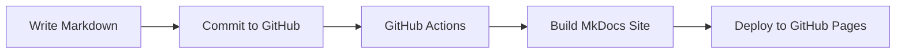

# Docs-As-Code Project

Welcome to the Docs-As-Code Project documentation portal.

This website demonstrates how to create, manage, and publish technical documentation using:

- Markdown
- MkDocs
- Material for MkDocs
- GitHub
- GitHub Actions
- GitHub Pages

---

## About This Project

Docs-as-Code is an approach where documentation is treated like source code.

Key principles:

- Write documentation in Markdown
- Store documentation in Git
- Review changes using Pull Requests
- Automate builds using CI/CD
- Publish documentation as a website

---

## Features

This documentation portal includes:

- Easy navigation
- Search capability
- Version control
- Responsive design
- GitHub integration
- Automated deployment

---

## Getting Started

### Prerequisites

Before using this project, ensure that you have:

- Python installed
- Git installed
- GitHub account

### Install MkDocs

```bash
pip install mkdocs
```

### Install Material Theme

```bash
pip install mkdocs-material
```

### Run the Website

```bash
mkdocs serve
```

Open your browser and navigate to:

```text
http://127.0.0.1:8000
```

---

## Documentation Structure

```text
Docs-As-CodeProject1
│
├── mkdocs.yml
│
└── docs
    ├── index.md
    └── userguide.md
```

---

## Sample Workflow



---

## User Guide

The User Guide explains how to:

- Navigate the documentation
- Search content
- Access API references
- Submit feedback

---

## Contributing

To contribute:

1. Create a new branch.
2. Update Markdown files.
3. Commit your changes.
4. Create a Pull Request.
5. Request review.

---

## Support

For questions or issues:

- Create a GitHub Issue
- Contact the Documentation Team

---

## Revision History

| Version | Date | Description |
|----------|------------|-------------|
| 1.0 | October 2026 | Initial Release |